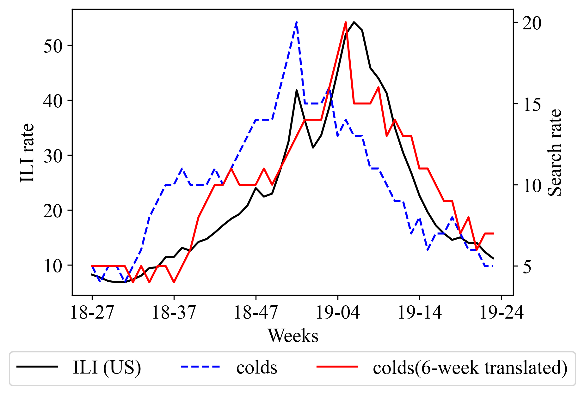
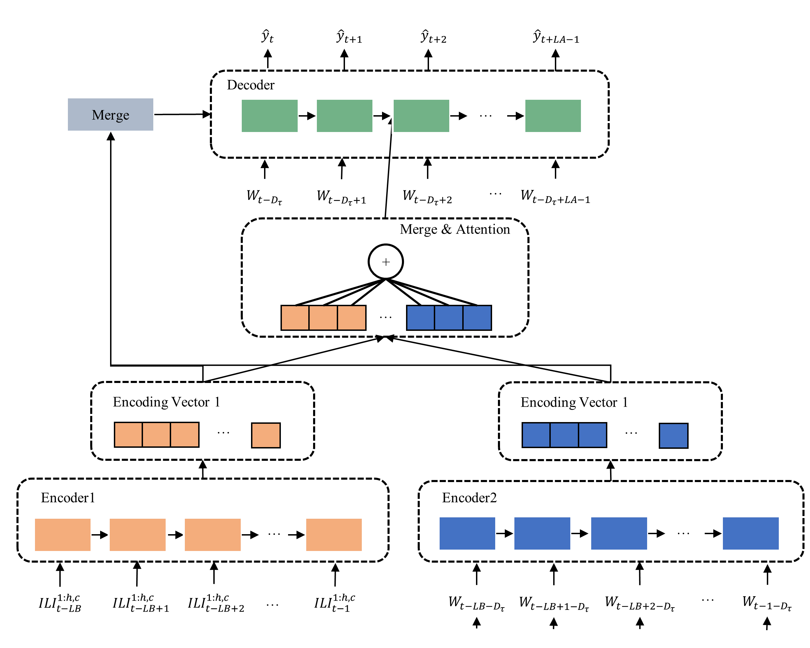
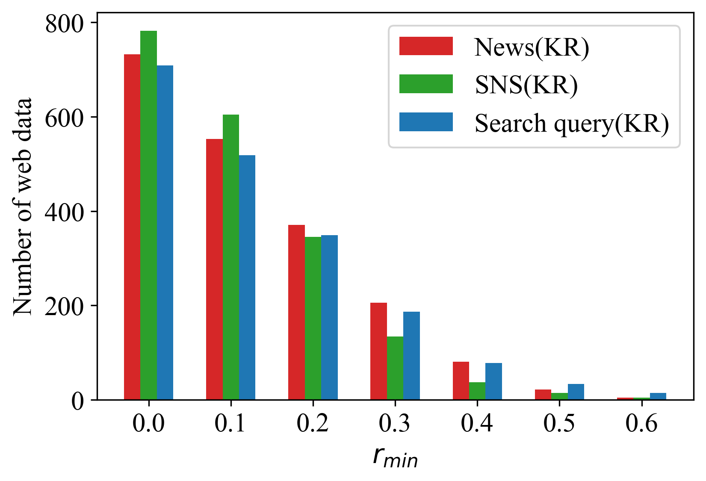
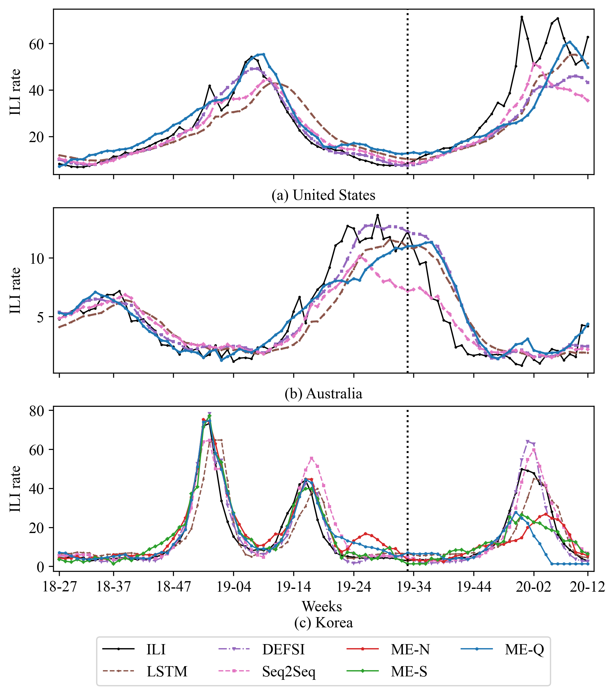
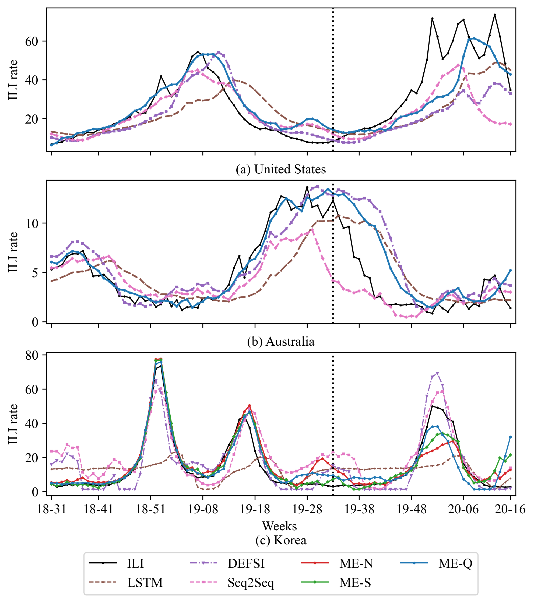
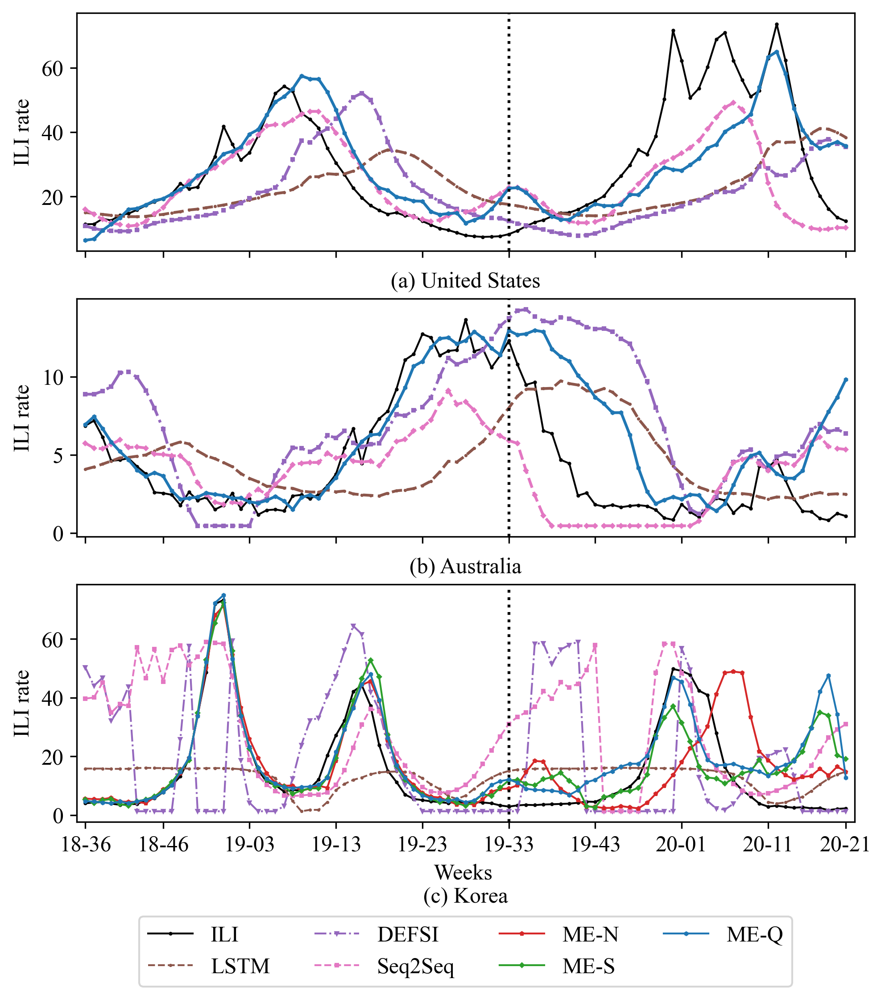

# Multi-encoding based influenza outbreak forecast in the distant future using time-delay of web data

### Intoduction
인플루엔자는 매년 290,000 - 650,000명의 사망자를 발생시키는 위협적인 감염병이다. 미국은 Center for Disease Control and Prevent (CDC), 유럽은 the European influenza Surveillance Scheme (EISS), 한국은 the Korean Centers for Disease Control
and Prevention (KCDC)를 통해 인플루엔자의 발생을 감시하고 있다. 그러나, 이런 전통적인 통계 기반 감시 방법은 사람들에게 정보가 제공되기까지 1-2주의 시간이 지연된다. 이 문제를 해결하기 위해 news, SNS, search query 등을 사용하여 인플루엔자 발생을 예측하는 연구들이 진행되어 왔다. 

대부분의 기존 연구들은 1-2주의 단기간 예측 문제에 집중하고 있다. 효과적인 인플루엔자 예방을 위해서는 5주 이상의 장기간 예측이 반드시 필요하지만, 장기간 예측은 예측 기간이 늘어남에 따라 예측의 오류가 누적되어 정확도가 크게 하락하는 문제를 갖는다. 이 문제를 해결하기 위해서 누적되는 예측의 오류를 보정할 유의미한 데이터를 찾는 것이 필수적이다.

위 그림은 미국의 인플루엔자 의사 환자 분율(influenza like illness, ILI)과 구글 검색 엔진에서 "colds"의 검색 비율, 그리고 그 비율을 6주 평행 이동 시킨 것을 보여준다. 이 처럼, 특정 웹 데이터는 ILI 와 시간 지연된 상관 관계를 가질 수 있으며 웹 데이터의 시간 지연된 부분은 미래 인플루엔자 예측을 위한 지표로 사용될 수 있다.
본 논문은 과거의 ILI 데이터와 시간 지연된 웹 데이터를 사용하여 장기간 인플루엔자를 예측하기 위해 웹 데이터의 시간 지연을 사용한 다중 인코딩 기반 인플루엔자 예측 모델을 제안한다.

본 논문의 핵심은 다음과 같다.

- 본 논문은 웹 데이터의 시간 지연성을 사용하여 높은 정확도를 갖는 장기간 인플루엔자 예측 방법을 제안한다.
- 제안된 모델의 다중 인코더는 웹 데이터 수집의 어려움에 따른 불충분한 학습량을 보완한다. 
- 본 논문은 인플루엔자 예측에 적합한 웹 데이터를 찾고 제안된 방법을 다양한 국가에 적용했다.
- 제안된 방법은 5주 이상의 장기간 예측에서 다른 최신 방법보다 더 높은 성능을 달성했다.

### Method

위 그림은 제안된 모델의 구조를 보여주며, 전체적인 과정은 4 steps로 구성되어 있다.

- Step 1. Word2vec을 사용해 인플루엔자와 연관된 단어 후보군을 추출하고 각 단어를 포함하는 웹 데이터를 수집한다.
- Step 2. 웹 데이터를 ILI rate와 동일한 주 단위 시계열 데이터로 변환한다. 이후, 교차상관을 사용하여 ILI rate와 웹 데이터의 시간 지연을 계산한다.
- Step 3. 다중 인코더는 과거의 ILI rate와 시간 지연된 웹 데이터로부터 특징을 추출한 두 개의 encoding vector를 생성한다.
- Step 4. Attention layer와 merge layer는 생성된 두 encoding vector를 연결하고 연결된 vector에 가중치를 부여한다. 디코더는 연결된 vector를 입력받아 ILI rate를 예측한다.

### Experiment

위 그림은 3개 국가(미국, 호주, 한국)에서 수집한 ILI rate를 보여준다.

위 그림은 한국에서 수집한 news, SNS, search query 데이터의 계산된 시간 지연을 나타내며 가장 상관관계가 높은 시간 지연은 진하게 표시되었고 제안된 모델에 사용되었다.

위 그림은 한국에서 수집한 웹 데이터의 시간 지연된 상관계수의 최소 값에 따른 데이터의 개수를 보여준다. 

위 그림은 1주 예측했을 때 각 모델들의 예측 결과이다. 

위 그림은 5주 예측했을 때 각 모델들의 예측 결과이다. 

위 그림은 10주 예측했을 때 각 모델들의 예측 결과이다. 

위 그림은 예측 기간을 1주부터 10주까지 증가시켰을 때 모델들의 성능을 비교한 것이다.

### Conclusion
본 논문은 장기간 인플루엔자 예측을 위해 시간 지연된 웹 데이터를 사용한 다중 인코딩 기반 신경망 모델을 제안하고 성능을 평가했다. 먼저, 세 가지 종류의 웹 데이터를 사용하여 제안된 모델을 비교했고 뉴스보다 SNS, search query가 인플루엔자 예측에 더 적합하다는 것을 찾았다. 두 번째로, 제안된 모델을 3개의 국가(미국, 호주, 한국)에 적용함으로써 제안된 모델이 지역적 특성에 비의존적이라는 것을 확인했다. 마지막으로 다른 최신 방법들과 제안된 방법을 비교했으며 제안된 방법이 5주 이상의 장기간 예측에서 더 좋은 성능을 보인다는 것을 확인했다.