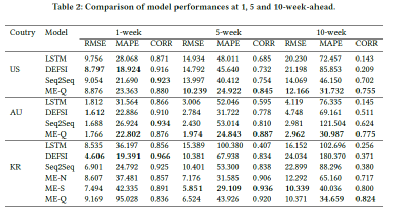

# Multi-encoding based influenza forecasting

## Motivation
- 인플루엔자는 매년 290,000 - 650,000명의 사망자를 발생시키는 위협적인 감염병임.
- 전통적인 통계 기반 감시 방법, e.g. CDC(미국), EISS(유럽), KCDC(한국), 은 사람들에게 정보가 제공되기까지 1-2주의 시간이 지연됨.
- 기존의 연구들은 1-2주의 단기간 예측의 정확도를 높이는 것에 집중되어 있음.
- 효과적인 인플루엔자 예방을 위해 5주 이상의 장기간 인플루엔자 예측이 필요함.

### Key idea

위 그림은 미국의 인플루엔자 발생 (influenza like illness, ILI)  비율과 구글에서의 "colds"의 검색 비율, 그리고 그 검색 비율을 6주 평행 이동 시킨 것을 보여준다. 이것은 특정 웹 데이터는 ILI와 시간 지연된 상관 관계를 갖기 때문에 지연된 이후 시점의 검색 비율 데이터는 미래 ILI 예측을 위한 지표로 사용될 수 있다.

## Method

위 그림은 제안된 모델의 구조를 보여주며, 전체적인 과정은 4 steps로 구성되어 있다.

- Step 1. Word2vec을 사용해 인플루엔자와 연관된 단어 후보군을 추출하고 각 단어를 포함하는 웹 데이터를 수집한다.
- Step 2. 웹 데이터를 ILI rate와 동일한 주 단위 시계열 데이터로 변환한다. 이후, 교차상관을 사용하여 ILI rate와 웹 데이터의 시간 지연을 계산한다.
- Step 3. 다중 인코더는 과거의 ILI rate와 시간 지연된 웹 데이터로부터 특징을 추출한 두 개의 encoding vector를 생성한다.
- Step 4. Attention layer와 merge layer는 생성된 두 encoding vector를 연결하고 연결된 vector에 가중치를 부여한다. 디코더는 연결된 vector를 입력받아 ILI rate를 예측한다.

## Experiment
### Data
| Type | Value |
| ----- | ----- |
| 종류 | ILI rate, 웹 데이터(News, SNS, Search query) |
| 수집 기간 | 2010년 1주차 - 2020년 20주차(ILI), 18.01.29 - 20.05.17(웹 데이터)
| 수집 국가 | 미국, 호주, 한국(웹 데이터의 경우 한국만)

위 그림은 미국, 호주, 한국에서 수집한 ILI rate를 보여준다.

### Time delay of web data

위 그림은 한국에서 수집한 News(Naver news), SNS(Twitter), Search query(Naver trends) 데이터의 시간 지연을 보여준다. 단어 후보군에 포함된 단어의 웹 데이터를 0주부터 15주까지 이동시켜가며 상관 관계를 측정했다. 상관 관계가 높을 수록 진하게 표시되었으며 가장 높은 상관 관계를 갖는 주차를 해당 데이터의 시간 지연으로 설정했다.

### Result

위 그림은 특정 시점(t)에서 10주 먼저 예측한 결과 값들을 연결한 그래프이다. 제안된 모델들(ME-N, ME-T, ME-Q)의 성능이 이전의 다른 모델들에 비해 장기간 예측이 정확한 것을 볼 수 있다.

위 표는 1, 5, 10주 예측 결과를 사용한 각 모델들의 성능 평가를 보여준다. 5주 이상의 장기간 예측에서 제안된 모델들의 성능이 높은 것을 보여준다. 

## Conclusion
- 제안된 웹 데이터의 시간 지연을 사용한 다중 인코딩 기반 인플루엔자 예측 모델은 5주 이상의 장기간 예측에서 기존 예측 모델보다 좋은 성능을 보임.
- 세 가지 웹 데이터(News, SNS, Search query) 중 SNS, Search query가 인플루엔자 예측에 더 적합한 것을 확인.
- 미국, 호주, 한국에서 제안된 모델을 평가하였고 다양한 국가에서 사용될 수 있음을 확인.
