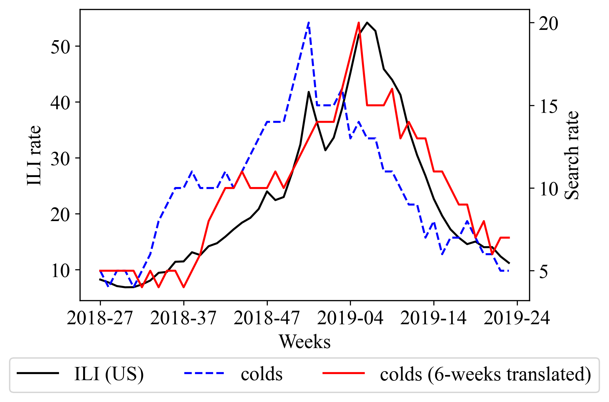
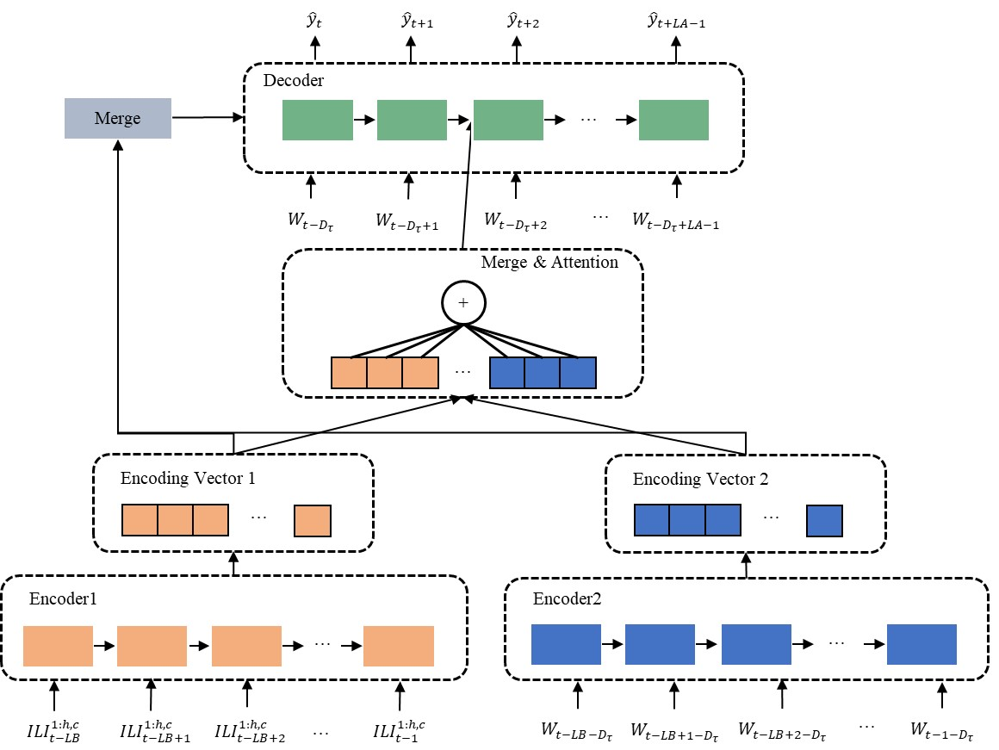
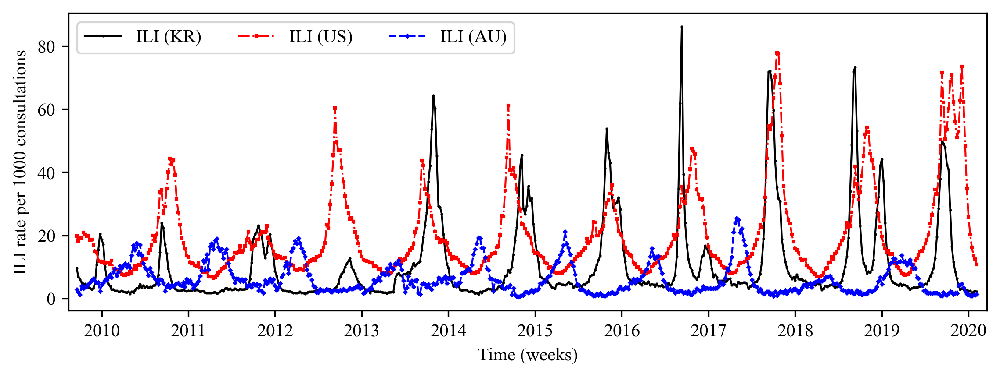

# Long-Term Influenza Outbreak Forecast using Time-Precedence Correlation of Web data

## Paper
Jang, Beakcheol, Inhwan Kim, and Jong Wook Kim. "Long-Term Influenza Outbreak Forecast Using Time-Precedence Correlation of Web Data." *IEEE Transactions on Neural Networks and Learning Systems (2021)*.

## Motivation
- 인플루엔자는 매년 290,000 - 650,000명의 사망자를 발생시키는 위협적인 감염병임
- 전통적인 통계 기반 감시 방법, e.g. CDC(미국), ASPREN(호주), KCDC(한국), 은 사람들에게 정보가 제공되기까지 1-2주의 시간이 지연됨
- 기존의 연구들은 1-2주의 단기간 예측의 정확도를 높이는 것에 집중되어 있음
- 효과적인 인플루엔자 예방을 위해 5주 이상의 장기간 인플루엔자 예측이 필요함

## Key idea

- 검은 실선은 미국의 인플루엔자 발생 (influenza like illness, ILI) 비율을 의미함
- 파란 점선은 키워드 "colds"의 구글 검색 비율을 의미함
- 빨간 실선은 키워드 "colds"의 검색 비율 그래프를 x축으로 6주 평행 이동한 것을 의미함
- 특정 웹 데이터의 검색 빈도는 ILI 시간 선행된 상관 관계를 갖기 때문에 미래 ILI 예측을 위한 지표로 사용될 수 있음

## Method

- Encoder1에는 lookback 크기 만큼의 현재/과거 ILI 데이터가 입력됨
- Encoder2에는 time-precedence를 고려한 lookback 크기 만큼의 현재 웹 데이터가 입력됨
- 각 Encoder는 LSTM으로 구성되어 있으며 출력된 encoding vectors를 연결
- 각 Encoder의 state는 Decoder의 초기 state로 사용됨
- Decoder에는 time-precedence를 고려한 lookahead 크기 만큼의 현재 웹 데이터가 입력됨
- Decoder는 attention을 사용해 encoding vector를 살펴보고 집중해야 할 지점을 탐색하여 최종 예측 결과를 출력함

## Experiment
### Data
| Type | Value |
| ----- | ----- |
| 종류 | ILI, Google Trends |
| 수집 기간 | 2010년 1주차 - 2020년 20주차(ILI), 2017년 35주차 - 2020년 20주차 (Google Trends)|
| 수집 국가 | 미국, 호주, 한국|

- 위 그림은 미국, 호주, 한국에서 수집한 ILI rate를 보여준다.

### Result

- Vanilla LSTM, DEFSI[1], STS-ATT[2]와 비교했을 때 제안된 방법이 2주 이상의 장기간 예측에서 높은 성능을 보임
- N, S, Q는 사용된 웹 데이터의 종류를 의미함 (N: News, S: SNS(twitter), Q: search query(Google trends))

## Conclusion
- 제안된 웹 데이터의 time-precedence를 사용한 인플루엔자 예측 모델은 2주 이상의 장기간 예측에서 기존 예측 모델보다 좋은 성능을 보임
- 세 가지 웹 데이터(News, SNS, Search query) 중 SNS, Search query가 인플루엔자 예측에 더 적합한 것을 확인.
- 미국, 호주, 한국에서 제안된 모델을 평가하였고 다양한 국가에서 사용될 수 있음을 확인.

---
References

[1] Wang, Lijing, Jiangzhuo Chen, and Madhav Marathe. "DEFSI: Deep learning based epidemic forecasting with synthetic information." Proceedings of the AAAI Conference on Artificial Intelligence. Vol. 33. No. 01. 2019.

[2] Kondo, Kenjiro, Akihiko Ishikawa, and Masashi Kimura. "Sequence to sequence with attention for influenza prevalence prediction using google trends." Proceedings of the 2019 3rd International Conference on Computational Biology and Bioinformatics. 2019.
